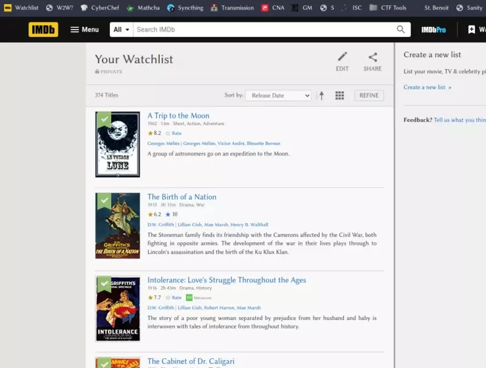

# IMDb Watchlist Random Movie Picker
A browser bookmark which, when on your IMDb watchlist page, will scroll to a random point on the page, and highlight a film to watch. If you're not happy with the choice, just click it again to get another recommendation.



## Installation
Just get the link from **[this webpage](https://lc.mt/imdb-bookmarklet)**, and drag it to your bookmarks bar.

(_Github doesn't support embedding javascript links on their site._)

## Source code
It's just simple js. Here is the source code:

```javascript
javascript:(function(){var t=setInterval(()=>{var e=document.querySelector('div[data-testid="ip_ref"]');e?e.scrollIntoView({behavior:"instant",block:"end"}):(clearInterval(t),function t(){var e=document.getElementsByClassName("ipc-metadata-list-summary-item");if(0===e.length)return;let o=Math.floor(Math.random()*e.length),l=e[o].style.backgroundColor,r=e[o].style.transform;e[o].style.backgroundColor="#F9FABE",e[o].style.boxShadow="0px 0px 22px #FF0",e[o].style.transform="scale(1.1)",e[o].style.transition="all 0.5s ease",e[o].scrollIntoView({behavior:"smooth",block:"center"}),setTimeout(()=>{e[o].style.backgroundColor=l,e[o].style.boxShadow="",e[o].style.transform=r},2e3)}())},1e3)})();
```

Here it is unminified:

```javascript
javascript:(function(){
    var intervalID = setInterval(() => {
        var loadMoreDiv = document.querySelector('div[data-testid="ip_ref"]');
        if (loadMoreDiv) {
            loadMoreDiv.scrollIntoView({ behavior: 'instant', block: 'end' });
        } else {
            clearInterval(intervalID);
            highlightRandomFilm();
        }
    }, 1000);
    function highlightRandomFilm() {
        var films = document.getElementsByClassName('ipc-metadata-list-summary-item');
        if (films.length === 0) return;
        const random_i = Math.floor(Math.random() * films.length);
        const old_colour = films[random_i].style.backgroundColor;
        const old_transform = films[random_i].style.transform;
        films[random_i].style.backgroundColor = "#F9FABE";
        films[random_i].style.boxShadow = "0px 0px 22px #FF0";
        films[random_i].style.transform = "scale(1.1)";
        films[random_i].style.transition = "all 0.5s ease";
        films[random_i].scrollIntoView({behavior: 'smooth', block: 'center'});
        setTimeout(() => {
            films[random_i].style.backgroundColor = old_colour;
            films[random_i].style.boxShadow = "";
            films[random_i].style.transform = old_transform;
        }, 2000);
    }
})();
```
